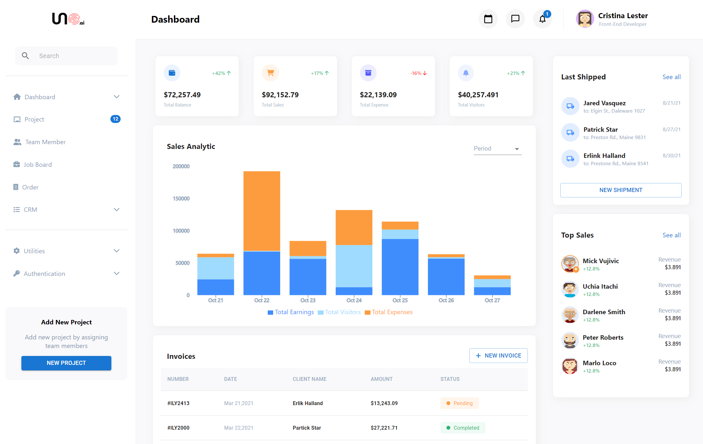

# Overview

This is a simple dashboard made with

- React
- Material UI
- Rechart
- FontAwesome

Designed by [Firman Jabbar](https://dribbble.com/firmanjabbar) and coded by me!

## Live Demo

Check out the live demo [here](https://michiyoyo.github.io/uno-dashboard/)!

## Installation

This project was bootstrapped with create-react-app.
To install the project, you can clone this repo and then run
`npm install`
to install the dependencies.

After the installation is complete, you can run the app locally with
` npm start`
